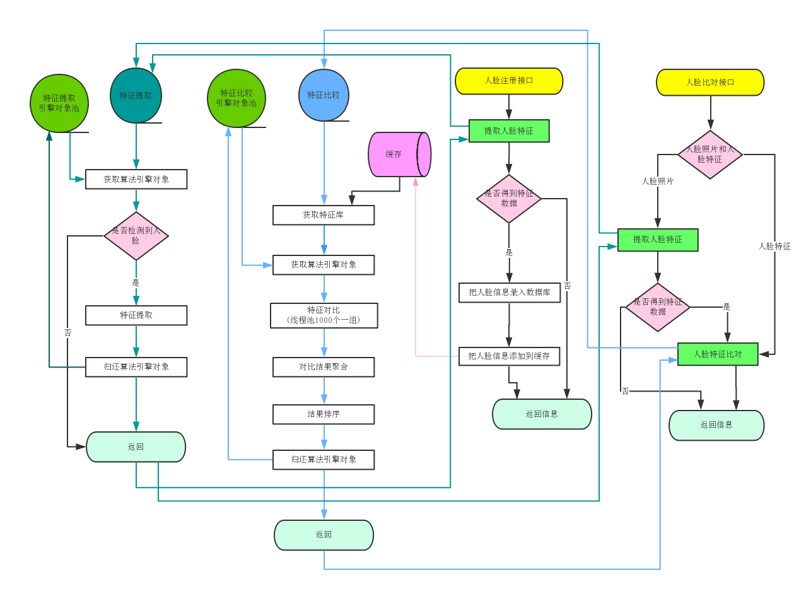

 
 
 
 
[整理了一些Java方面的架构、面试资料（微服务、集群、分布式、中间件等），有需要的小伙伴可以关注公众号【程序员内点事】，无套路自行领取](https://mp.weixin.qq.com/s/7Sb-INOrSfQ00sxETLmNog)
 
### 关注公众号：程序员内点事
 
###  更多有意思、涨知识的项目等着你
 
### 有任何技术问题，欢迎随时沟通

--- 

## 开发环境准备：
###开发使用到的软件和工具：
* Jdk8、mysql5.7、libarcsoft_face.dll(so)、libarcsoft_face_engine.dll(so)、libarcsoft_face_engine_jni.dll(so)、idea
* 注：libarcsoft_face.dll(so)、libarcsoft_face_engine.dll(so)、libarcsoft_face_engine_jni.dll(so)、app-id、sdk-key可以到虹软官网 http://ai.arcsoft.com.cn/ 免费申请下载

* 本地配置：
	* 配置环境(推荐jdk8，mysql5.7，maven3，idea)
    * 引擎库libarcsoft_face、libarcsoft_face_engine、libarcsoft_face_engine_jni。把dll或so文件拷贝到java.library.path所包含的路径下,注意区分X86和X64，和当前jdk版本一致。
  
* 初始化项目
创建数据库arcsoft_face_demo，执行脚本arcsoft_face_demo.sql

* 使用idea启动项目
    * 修改配置文件src\main\resources\application.properties
        * 填写数据库地址：spring.datasource.druid.url
        * 填写数据库用户名：spring.datasource.druid.username
        * 填写数据库密码：spring.datasource.druid.password
        * 填写人脸识别id：config.freesdk.app-id
        * 填写人脸识别key：config.freesdk.sdk-key

 
* 启动项目
    * 右键Application，选择Run ‘Application’
 

* 项目访问地址
    * http://127.0.0.1:8080/demo

### 更详细的流程参考：

### 项目流程图
 

